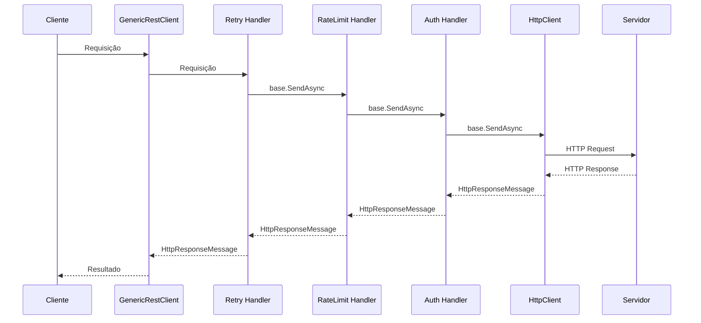

# Fluxo de Requisições - Cadeia de Handlers

Este documento explica o fluxo básico das requisições através dos handlers do GenericRestClient.

### Ordem de Registro (no código)
⚠️ **Importante**: A ordem de execução dos handlers é **inversa** à ordem de registro!
```csharp
1. Authentication Handler
2. RateLimit Handler  
3. Retry Handler
```

## Descrição dos Módulos

### Retry Handler
- **Função**: Implementa retry automático para falhas transitórias
- **Processa**: Requisições e respostas (pode fazer retry em caso de erro)

### RateLimit Handler
- **Função**: Controla taxa de requisições por minuto
- **Processa**: Apenas requisições (lança exceção se limite atingido)

### Authentication Handler
- **Função**: Adiciona credenciais de autenticação
- **Tipos**: Bearer, OAuth2, ApiKey
- **Processa**: Apenas requisições (adiciona headers/tokens)

## Diagrama de Sequência



## Configuração

### 1. Configuração no appsettings.json

Configure os handlers através da seção `ApiClient` no arquivo `appsettings.json`:

```json
{
  "ApiClient": {
    "BaseUrl": "https://api.exemplo.com/",
    
    "Authentication": {
      "Enabled": true,
      "Type": "OAuth2",
      "GrantType": "client_credentials",
      "ClientId": "seu-client-id",
      "ClientSecret": "seu-client-secret",
      "TokenEndpoint": "https://auth.exemplo.com/token",
      "BearerToken": "seu-bearer-token",
      "ApiKey": "sua-api-key",
      "ApiKeyHeader": "x-api-key",
      "TokenRefreshSkewSeconds": 60
    },
    
    "RateLimit": {
      "Enabled": true,
      "RequestsPerMinute": 60
    },
    
    "Retry": {
      "Enabled": true,
      "MaxRetries": 3,
      "BaseDelayMilliseconds": 500,
      "UseExponentialBackoff": true
    }
  }
}
```

#### Opções de Autenticação

**Bearer Token:**
```json
"Authentication": {
  "Enabled": true,
  "Type": "Bearer",
  "BearerToken": "seu-bearer-token"
}
```

**OAuth2:**
```json
"Authentication": {
  "Enabled": true,
  "Type": "OAuth2",
  "GrantType": "client_credentials",
  "ClientId": "seu-client-id",
  "ClientSecret": "seu-client-secret",
  "TokenEndpoint": "https://auth.exemplo.com/token",
  "TokenRefreshSkewSeconds": 60
}
```

**API Key (Header):**
```json
"Authentication": {
  "Enabled": true,
  "Type": "ApiKey",
  "ApiKey": "sua-api-key",
  "ApiKeyHeader": "x-api-key"
}
```

**API Key (Query String):**
```json
"Authentication": {
  "Enabled": true,
  "Type": "ApiKey",
  "ApiKey": "sua-api-key"
}
```

#### Opções de RateLimit

```json
"RateLimit": {
  "Enabled": true,
  "RequestsPerMinute": 60
}
```

- `Enabled`: Habilita/desabilita o rate limiting
- `RequestsPerMinute`: Número máximo de requisições por minuto
- **Comportamento**: Quando o limite é atingido, o handler lança uma exceção `Exception` com a mensagem "Rate limit reached"

#### Opções de Retry

```json
"Retry": {
  "Enabled": true,
  "MaxRetries": 3,
  "BaseDelayMilliseconds": 500,
  "UseExponentialBackoff": true
}
```

- `Enabled`: Habilita/desabilita o retry automático
- `MaxRetries`: Número máximo de tentativas (padrão: 3)
- `BaseDelayMilliseconds`: Delay base entre tentativas em milissegundos (padrão: 500)
- `UseExponentialBackoff`: Usa backoff exponencial (true) ou linear (false)

### 2. Registro dos Handlers no Program.cs

Registre os handlers no método de configuração da aplicação:

```csharp
using GenericRestClient.Core;
using GenericRestClient.Extensions;
using Microsoft.Extensions.Configuration;
using Microsoft.Extensions.DependencyInjection;
using Microsoft.Extensions.Hosting;

var builder = Host.CreateApplicationBuilder(args);
builder.Configuration
   .AddJsonFile("appsettings.json", optional: false, reloadOnChange: true)
   .AddEnvironmentVariables();

// 1. Registrar RestClient
var httpClientBuilder = builder.Services.ConfigureGenericRestClient(builder.Configuration);

// 1.1. Adicionar headers customizados (opcional)
httpClientBuilder.ConfigureHttpClient(client =>
{
    if (!client.DefaultRequestHeaders.Contains("User-Agent"))
    {
        client.DefaultRequestHeaders.Add("User-Agent", "GenericRestClient/1.0");
    }
});

// 2. Configurar handlers baseado nas opções
var options = builder.Configuration.GetSection("ApiClient")
    .Get<GenericRestClient.Configuration.ApiClientOptions>();

// 2.1. Authentication Handler
if (options?.Authentication?.Enabled == true)
{
    var authType = options.Authentication.Type?.Trim().ToUpperInvariant();
    switch (authType)
    {
        case "BEARER":
            httpClientBuilder.AddBearerAuthentication();
            break;
        case "APIKEY":
            httpClientBuilder.AddApiKeyAuthentication();
            break;
        case "OAUTH2":
            httpClientBuilder.AddOAuth2Authentication();
            break;
    }
}

// 2.2. RateLimit Handler
if (options?.RateLimit?.Enabled == true)
{
    httpClientBuilder.AddRateLimit();
}

// 2.3. Retry Handler
if (options?.Retry?.Enabled == true)
{
    httpClientBuilder.AddRetry();
}

var host = builder.Build();
var client = host.Services.GetRequiredService<IRestClient>();
```